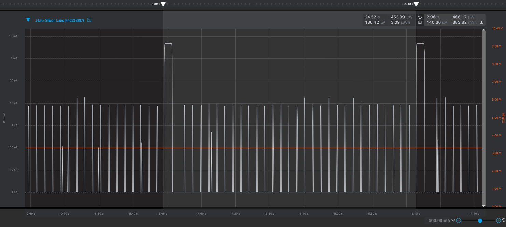
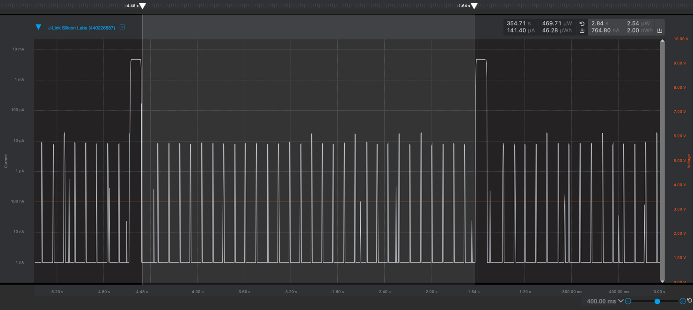
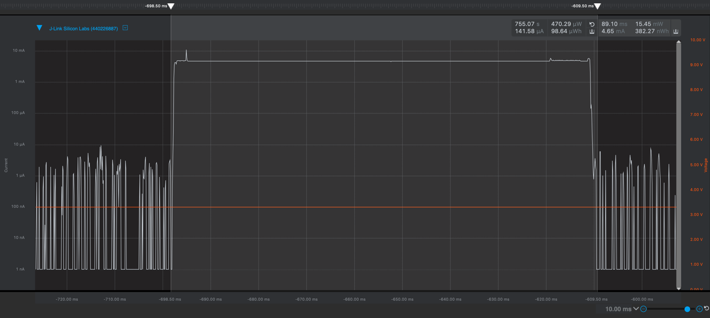

Please include your answers to the questions below with your submission, entering into the space below each question
See [Mastering Markdown](https://guides.github.com/features/mastering-markdown/) for github markdown formatting if desired.

*Be sure to take measurements with logging disabled to ensure your logging logic is not impacting current/time measurements.*

*Please include screenshots of the profiler window detailing each current measurement captured.  See the file Instructions to add screenshots in assignment.docx in the ECEN 5823 Student Public Folder.* 

1. What is the average current per period?
   Answer: 140.36 uA
    Screenshot:  
     
   
2. What is the average current when the Si7021 is Powered Off?  
   Answer: 764.80 nA
    Screenshot:  
   
   
3. What is the average current when the Si7021 is Powered On?  
   Answer: 4.65 mA
    Screenshot:  
   
   
4. How long is the Si7021 Powered On for 1 temperature reading?  
   Answer: 89.10 ms
    Screenshot:  
   
