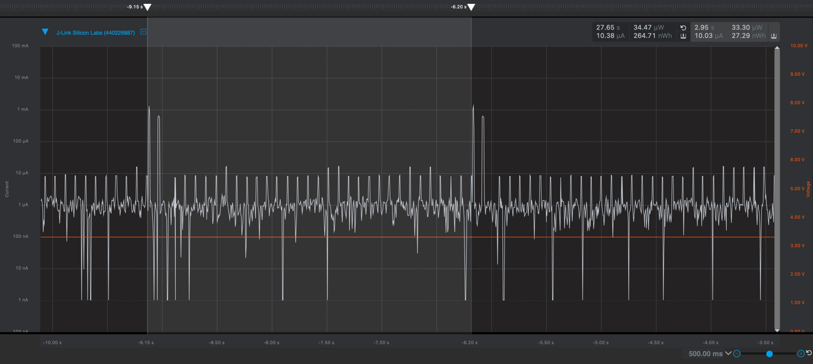
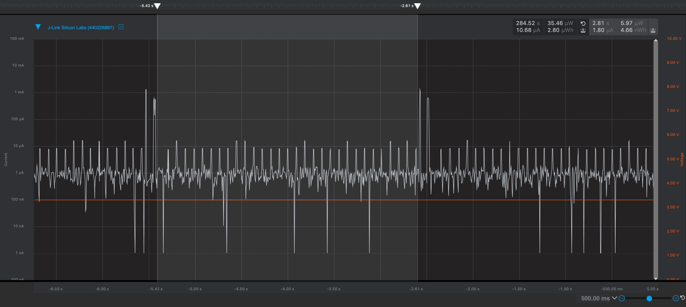
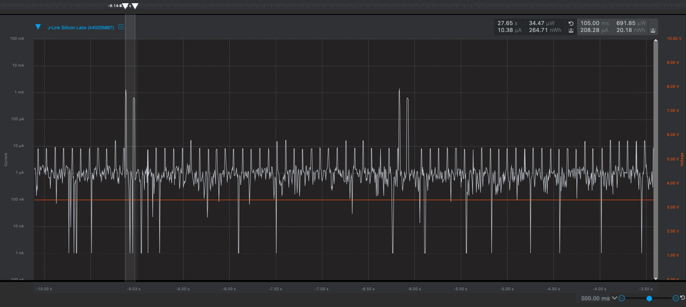

Please include your answers to the questions below with your submission, entering into the space below each question
See [Mastering Markdown](https://guides.github.com/features/mastering-markdown/) for github markdown formatting if desired.

*Be sure to take measurements with logging disabled to ensure your logging logic is not impacting current/time measurements.*

*Please include screenshots of the profiler window detailing each current measurement captured.  See the file Instructions to add screenshots in assignment.docx in the ECEN 5823 Student Public Folder.* 

1. What is the average current per period?
   Answer: 10.03 uA
    Screenshot:  
     

2. What is the average current when the Si7021 is Powered Off?
   Answer: 1.80 uA
    Screenshot:  
     

3. What is the average current when the Si7021 is Powered On?
   Answer: 208.28 uA
    Screenshot:  
     

4. How long is the Si7021 Powered On for 1 temperature reading?
   Answer: 105.0 ms
    Screenshot:  
     

5. Compute what the total operating time of your design for assignment 4 would be in hours, assuming a 1000mAh battery power supply?
   Answer: 97,087 hours
   Battery Life (in hours) = Battery Capacity (in mAh) / Load Current (in mA) = 1000 / 0.0103 = ~97087
   Source: https://www.digikey.com/en/resources/conversion-calculators/conversion-calculator-battery-life
   
6. How has the power consumption performance of your design changed since the previous assignment?
   Answer: The average current per period in the previous assignment was 140.36 uA, and 4.65 mA when the Si7021 was powered on.
   Thus, the power consumption has been reduced dramatically: improvements of 14x and 22x for total period and on period, respectively.
   This demonstrates the benefit of interrupt-driven i2c and timer code. Polling is very energy inefficient in embedded systems.
   
7. Describe how you tested your code for EM1 during I2C transfers
   Answer: I checked current in the energy profiler when the code was running configured in different energy modes, 
   observing the differences in current when changing the LOWEST_ENERGY_MODE value in app.h from EM0 to EM1 to EM2 tos EM3.
   
   In addition, I set breakpoints on lines of code where the power manager functions were called and within the I2C interrupt handler (indicating a transfer finished).
   I then stepped through the Silicon Labs library code to ensure the correct variables and registers were being set for operation in EM1.
