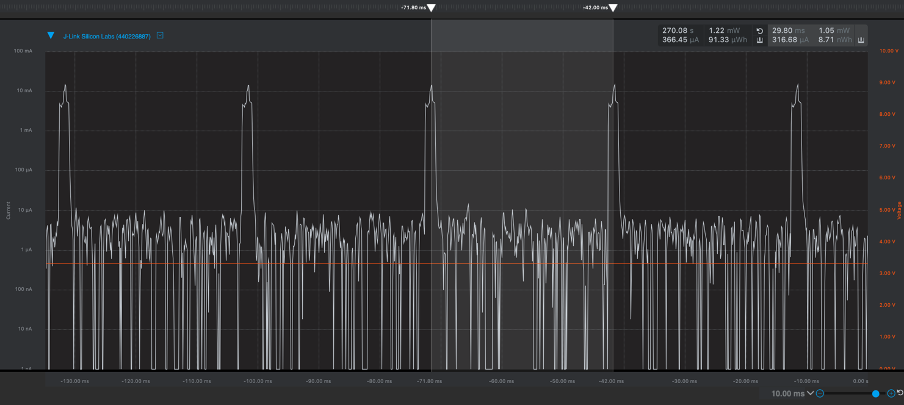

Please include your answers to the questions below with your submission, entering into the space below each question
See [Mastering Markdown](https://guides.github.com/features/mastering-markdown/) for github markdown formatting if desired.

*Be sure to take measurements with logging disabled to ensure your logging logic is not impacting current/time measurements.*

*Please include screenshots of the profiler window detailing each current measurement captured.  See the file Instructions to add screenshots in assignment.docx in the ECEN 5823 Student Public Folder.*

1. Provide screen shot verifying the Advertising period matches the values required for the assignment.
   Answer: 249.60 ms
    Screenshot:  
     

2. What is the average current between advertisements?
   Answer: 2.57 uA
    Screenshot:  
     

3. What is the peak current of an advertisement? 
   Answer: 26.23 mA
    Screenshot:  
     

4. Provide screen shot showing the connection interval settings. Do they match the values you set in your slave(server) code or the master's(client) values?.
   The connection interval value logged by handle_ble_event() corresponds to the master's/client's value.
   The connection interval observed in the energy profiler of 29.8 ms corresponds to a value of 24 set in the API call.
   
   Client Values:
   Connection Interval = 24 (29.8 ms / 1.25 = 23.8 = ~24)
   Latency = 0
   Timeout = 72
   
   Server Values:
   Connection Interval = 60 (75 ms / 1.25 = 60)
   Latency = 3
   Timeout = 80
   
    Screenshots: 
     
     

5. What is the average current between connection intervals?
   Answer: 2.10 uA
    Screenshot:  
     

6. If possible, provide screen shot verifying the slave latency matches what was reported when you logged the values from event = gecko_evt_le_connection_parameters_id. 
   The slave latency was set to 0 by the client, which means that no connection events can be skipped. This behavior is shown in the energy profiler graph.
    Screenshot:  
     

7. What is the peak current of a data transmission when the phone is connected and placed next to the Blue Gecko? 
   Answer: 5.45 mA
    Screenshot:  
     
   
8. What is the peak current of a data transmission when the phone is connected and placed approximately 20 feet away from the Blue Gecko? 
   Answer: 5.60 mA
    Screenshot:  
     
   